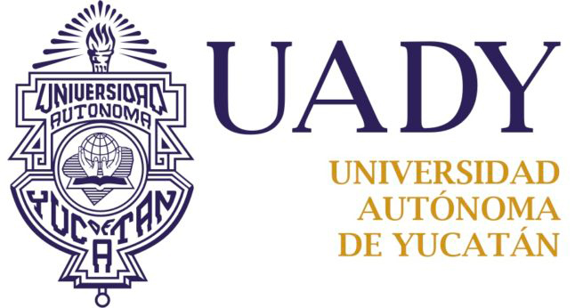

# Proyecto InfoUADY

# Equipo

* Luis Manuel Lagunez Rodríguez.
* Raúl Ismael Batun Nahuat.
* Manuel Enrique Cupul May.
* Jonatan Alberto Cuxim Poot

# Descripción General

Este repositorio preserva el progreso y trabajo colaborativo realizado en el proyecto **InfoUADY** para la asignatura **Fundamentos de Ingeniería de Software** impartida en primer semestre. Nuestro proyecto busca el desarrollo de una página web que sirve como centro de ayuda de temas escolares orientada, principalmente, hacía alumnos de nuevo ingreso de la Unidad Multidisciplinaría Tizimín.

De igual manera, nos ayuda a poner en práctica la teoría aprendida en clase y darle un sentido para obtener una mejor aplicación de los conceptos de un proceso de desarrollo de software.

# ¿Que es InfoUADY?

Es un proyecto desarrollado por estudiantes de Ingeniería de Software que buscan crear un centro de ayuda para las preguntas más frecuentes que pueden surgir durante la estudia universitaria, dichas preguntas no se suelen abordar con especificidad en los cursos de inducción o los estudiantes hacen caso omiso de este curso y no saben que necesitarán de esta información hasta que deben realizar algún tramite en específico.

# Índice Primera Entrega
* [Proyecto InfoUADY](Documentación/1ra_Entrega/Proyecto_InfoUADY.pdf)
* [Objetivo](Documentación/1ra_Entrega/Objetivo.md)
* [Usuarios](Documentación/1ra_Entrega/Usuarios.md)
* [Historias de Usuario](Documentación/1ra_Entrega/Historias_de_Usuario.md)
* [Metodología y Roles](Documentación/1ra_Entrega/Metodologia_y_Roles.md)
* [Requerimientos](Documentación/1ra_Entrega/Requerimientos.md)
* [Métricas](Documentación/1ra_Entrega/Métricas.pdf)
* [Diagrama Caso de Uso](Documentación/1ra_Entrega/Diagrama_Caso_de_Uso.PNG)
* [Cronograma de Actividades](Documentación/1ra_Entrega/Cronograma_Actividades.PNG)
* [Bitácoras](Documentación/Bitácora.md)
